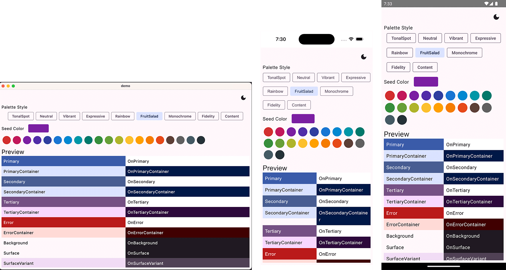

# Material Kolor Demo

## Before running!

- check your system with [KDoctor](https://github.com/Kotlin/kdoctor)
- install JDK 8 on your machine
- install
  the [Kotlin Multiplatform Mobile plugin](https://plugins.jetbrains.com/plugin/14936-kotlin-multiplatform-mobile)
- add `local.properties` file to the project root and set a path to Android SDK there
- run `./gradlew podInstall` in the project root

## Running

Open the project in Android Studio and let it sync the project. In the configuration dropdown should
be the following:

- androidApp
- Desktop
- Browser
- iosApp

You can select a configuration and run it, or follow the steps below.

### Android

To run the application on android device/emulator:

- open project in Android Studio and run imported android run configuration

To build the application bundle:

- run `./gradlew :composeApp:assembleDebug`
- find `.apk` file in `composeApp/build/outputs/apk/debug/composeApp-debug.apk`

### Desktop

Run the desktop application: `./gradlew :composeApp:run`

### iOS

To run the application on iPhone device/simulator:

- Open `iosApp/iosApp.xcworkspace` in Xcode and run standard configuration
- Or
  use [Kotlin Multiplatform Mobile plugin](https://plugins.jetbrains.com/plugin/14936-kotlin-multiplatform-mobile)
  for Android Studio

### Browser

Run the browser application: `./gradlew :composeApp:jsBrowserDevelopmentRun`

