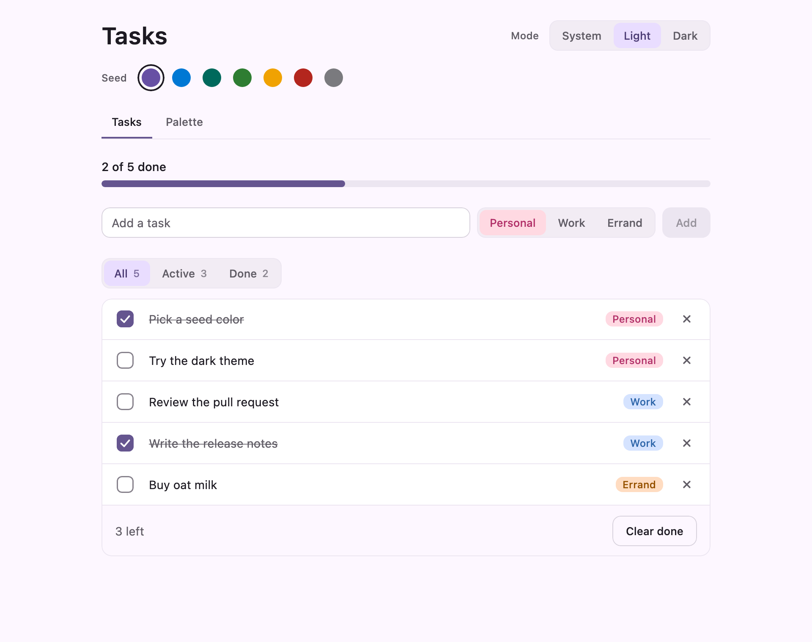
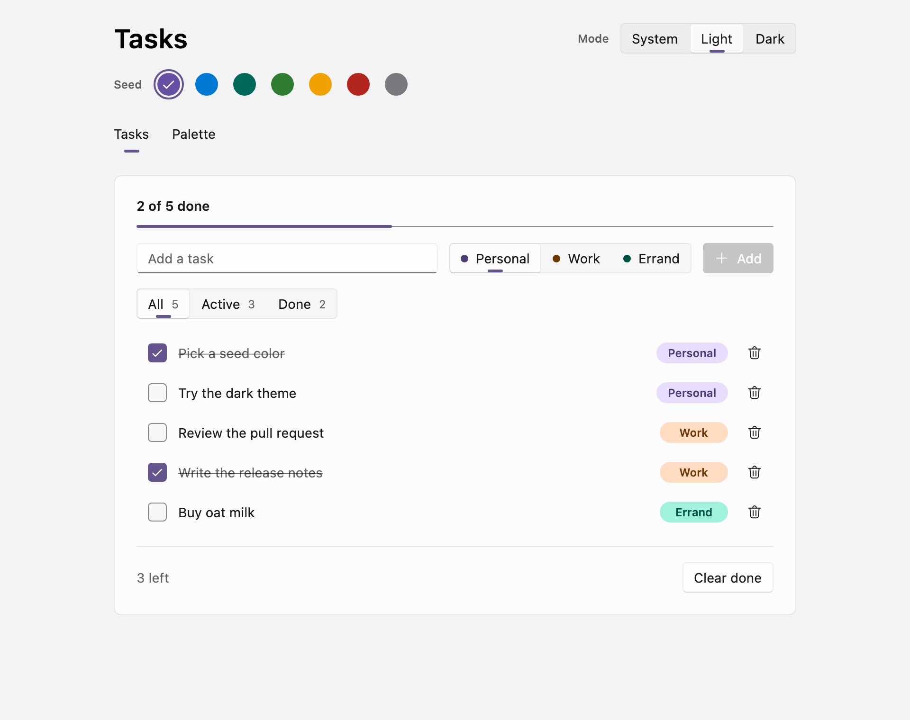
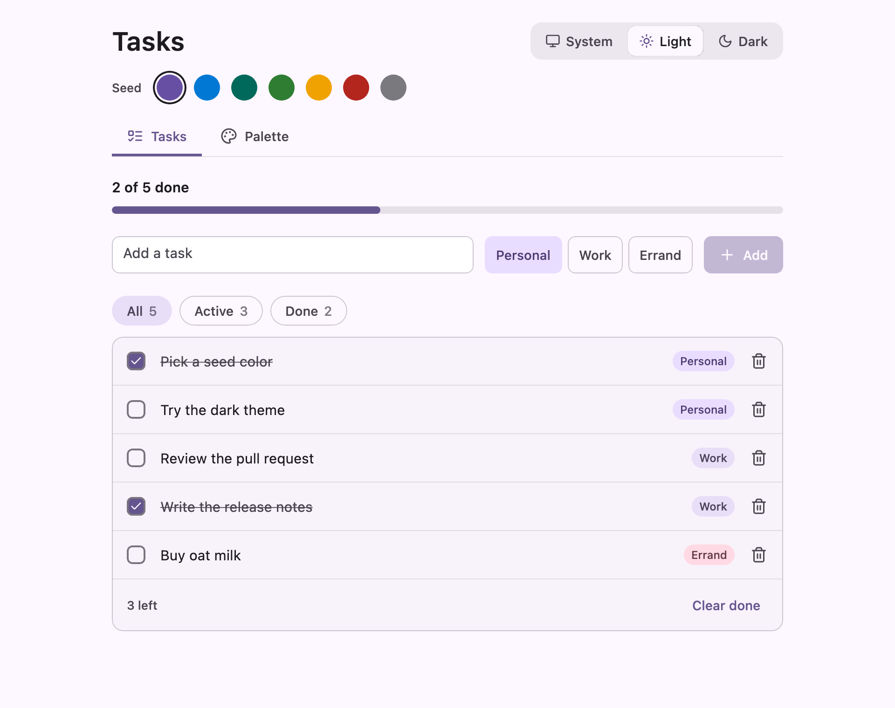

# Samples

Every sample is the same small app, **Tasks**, built three times on three different UI stacks. The
behaviour, the copy and the data are shared. Only the UI and the theme wiring change, so you can put
two samples side by side and see exactly what each stack asks of you.

| Sample | UI stack | Theme from MaterialKolor | Run it |
|---|---|---|---|
| [`custom-theme`](custom-theme) | Compose Foundation and hand-rolled components | `material-kolor-core` tonal ramps into an app-owned `AppColors` | `./gradlew :samples:custom-theme:run` |
| [`fluent`](fluent) | [Compose Fluent](https://github.com/compose-fluent/compose-fluent-ui) | `material-kolor-fluent` | `./gradlew :samples:fluent:run` |
| [`unstyled`](unstyled) | [Compose Unstyled](https://composeunstyled.com) | `material-kolor-unstyled` | `./gradlew :samples:unstyled:run` |

| `custom-theme` | `fluent` | `unstyled` |
|---|---|---|
|  |  |  |

## Modules

- [`shared`](shared) holds everything that is not UI. The task model, the theme settings, one
  reducer, a small store and the copy every sample shows.
- Each sample owns its UI, its theme and a `Main.kt` desktop entry point.
- [`screenshots`](screenshots) renders both tabs of every sample in light and dark, full page, into
  `samples/screenshots/build/screenshots`, and refreshes the three shots above in
  [`screenshots/images`](screenshots/images). Run it with `./gradlew screenshots`.

## The app

Tasks is a to-do list with a theme picker on top. It is small enough to read in one sitting and
still has the controls most apps need. A text field, buttons, a checkbox, segmented choices, tabs,
a progress bar, a scrolling list, an empty state and a confirmation dialog.

```
┌──────────────────────────────────────────────────────────────┐
│ Tasks                                  [ System|Light|Dark ] │
│ ● ● ● ● ● ● ●                                  seed swatches │
│ [ Tasks ]  [ Palette ]                                       │
├──────────────────────────────────────────────────────────────┤
│ 2 of 5 done                                                  │
│ ██████████░░░░░░░░░░░░░░                                     │
│                                                              │
│ [ Add a task                 ]  (Personal|Work|Errand) [Add] │
│                                                              │
│ [ All ]  [ Active ]  [ Done ]                                │
│ ☑  Pick a seed color            Personal              ✕      │
│ ☐  Try the dark theme           Personal              ✕      │
│ ☐  Review the pull request      Work                  ✕      │
│ ☑  Write the release notes      Work                  ✕      │
│ ☐  Buy oat milk                 Errand                ✕      │
│                                                              │
│ 3 left                                      [ Clear done ]   │
└──────────────────────────────────────────────────────────────┘
```

### Header

- The title, then a three way mode picker (System, Light, Dark).
- A row of seven seed swatches. Picking one regenerates the whole theme from that seed.
- Two sections, Tasks and Palette.

### Tasks section

- A summary line ("2 of 5 done") and a progress bar for the same ratio.
- The composer. A text field, a tag picker (Personal, Work, Errand) and an Add button. Add stays
  disabled while the field is blank. Pressing Enter in the field does the same as Add. After a task is
  added the field clears and keeps focus.
- A filter (All, Active, Done) over the list.
- One row per task with a checkbox, the title, a tag chip and a delete button. Finished titles are
  struck through and muted. Each tag gets its own accent color from the theme, and each sample decides
  which accent that is.
- An empty state when the filter matches nothing. The message depends on the filter.
- A footer with the remaining count and a Clear done button. Clear done is disabled when nothing is
  finished. It asks first with a dialog (Keep or Clear).

### Palette section

The one place the samples are allowed to differ in content. Each sample shows what its theme
module produces for the current seed and mode, so this is where the old single-screen demos live now.

### Starting state

Seed Violet, mode System, section Tasks, filter All, composer tag Personal, and these five tasks.

| Id | Title | Tag | Done |
|---|---|---|---|
| 1 | Pick a seed color | Personal | yes |
| 2 | Try the dark theme | Personal | no |
| 3 | Review the pull request | Work | no |
| 4 | Write the release notes | Work | yes |
| 5 | Buy oat milk | Errand | no |

## Rules for a sample

- Read state from the shared store and change it only by dispatching shared actions. No sample keeps
  its own copy of the task list, the filter, the seed or the mode.
- Show the shared copy. Do not hardcode a label the shared module already has.
- Colors come from the theme. No literal colors in the UI code.
- A behaviour change goes into `shared` first, then into all three samples in the same change.
