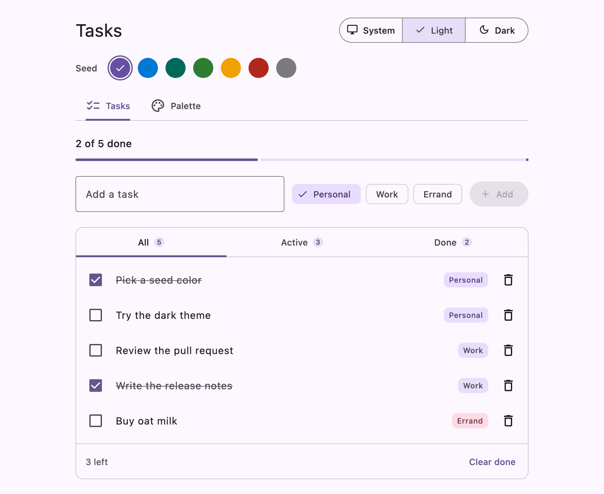

# Samples

Every sample is the same small app, **Tasks**, built four times on four different UI stacks. The behaviour, the copy and the data are shared. Only the UI and the theme wiring change.

| Sample | UI stack | Theme from MaterialKolor | Run it |
|---|---|---|---|
| [`custom-theme`](custom-theme) | Compose Foundation and hand-rolled components | `material-kolor-core` tonal ramps into an app-owned `AppColors` | `./gradlew :samples:custom-theme:run` |
| [`fluent`](fluent) | [Compose Fluent](https://github.com/compose-fluent/compose-fluent-ui) | `material-kolor-fluent` | `./gradlew :samples:fluent:run` |
| [`material3`](material3) | [Compose Material 3](https://developer.android.com/jetpack/compose/designsystems/material3) | `material-kolor-material3` | `./gradlew :samples:material3:run` |
| [`unstyled`](unstyled) | [Compose Unstyled](https://composeunstyled.com) | `material-kolor-unstyled` | `./gradlew :samples:unstyled:run` |

| `custom-theme` | `fluent` |
|---|---|
|  |  |
| **`material3`** | **`unstyled`** |
|  |  |

## Modules

- [`shared`](shared) holds everything that is not UI. The task model, the theme settings, one
  reducer, a small store and the copy every sample shows.
- Each sample owns its UI, its theme and a `Main.kt` desktop entry point.
- [`screenshots`](screenshots) renders both tabs of every sample in light and dark, full page, into
  `samples/screenshots/build/screenshots`, and refreshes the four shots above in
  [`screenshots/images`](screenshots/images). Run it with `./gradlew screenshots`.
